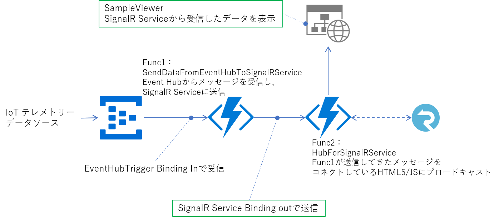

# SignalR Service を使って、IoT のテレメトリーデータを配布する 
IoTデバイスなどがクラウドに送信してくるテレメトリーデータを インターネットで接続されたクライアントに転送するシステムのサンプル 

 
Event Hub（IoT Hubでも可）が受信したデータを、Event Hub Trigger のバインディングで Azure Function で受信し、SignalR Service バインディングで、SignalR に転送し、SignalR に接続した Web Browser 等で開いている、Web ページ（クライアント）で受信する。 
※ SignalR Serviceの詳細は[こちら](https://docs.microsoft.com/ja-jp/azure/azure-signalr/signalr-overview)を参照
## 試してみるために必要な環境 
- Azure Subscription (無料お試しでも可) 
- Visual Studio 2017 以上 
## 手順 
1. SignalR Service を作成する - 作り方は、[Azure SignalR リソースを作成](https://docs.microsoft.com/ja-jp/azure/azure-signalr/signalr-quickstart-dotnet-core#create-an-azure-signalr-resource)を参照 
2. Event Hub を作成する - 作り方は、[こちら](https://docs.microsoft.com/ja-jp/azure/event-hubs/event-hubs-create)を参照 
3. Func1を作成 - [SendMessageFromEventToSignalRService](SendMessageFromEventToSignalRService) を参照 
4. Func2を作成 - [HubForSignalRService](HubForSignalRService)を参照 
5. Sample Viewer を開く -[SampleViewer](SampleViewer)を参照 
5. ダミーデータを送信するテストアプリを起動 - [Test/WpfAppSendTest](Test/WpfAppSendTest) を参照 